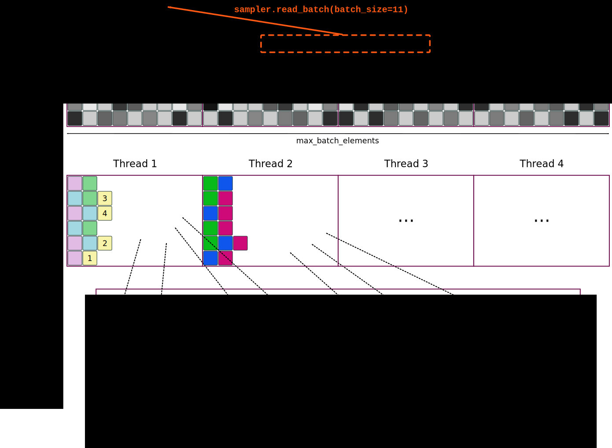

# NVMe Sampler

Library for sampling batches of rows from a binary dataset file. 

This library was created to allow **very fast** sampling from very large (e.g. 4 TiB) datasets that do not fit into RAM in order to train models using PyTorch.

NVMe sampler implements sampling with replacement, however it's possible to modify it to support sampling without replacement.

In our setting (software RAID-0 disk array consisting of 3 Intel SSD DC P4500), we are able to sample 5.1 million random samples per second (6.2 GiB/s). 

NVMe Sampler uses file system interface and Linux kernel Asynchronous I/O (libaio) so it can also sample from SATA SSD drives.

## Features

- very fast sampling
- simple interface
- does not pollute system page cache

## Components

- C++ library `libnvme_sampler` 
- PyTorch wrapper for `libnvme_sampler`

## Installation 


```bash
make
./setup.py install

# OR to build C++ library without PyTorch wrapper:
make lib
```

### Requirements

NVMe Sampler should work on any modern Linux distribution. It requires GCC-7, libaio and make. On Ubuntu 16.04 you can install all those 
dependencies using:

```bash
sudo apt-get install -y software-properties-common
sudo add-apt-repository ppa:jonathonf/gcc-7.1
sudo apt-get update
sudo apt-get install -y g++-7 make libaio-dev
```


## Usage

```python
from nvme_sampler import NvmeSampler

sampler = NvmeSampler(
    "path/to/binary_dataset",
    num_rows=num_rows,                # number of samples in file
    row_size_b=row_size * 4,          # size in bytes of a single sample
    max_batch_elements=8192,          # limits the batch_size passed in subsequent read_batch() calls
    memory_usage_limit_b=1000000000   # limits memory usage (in bytes)
)

tensor1 = sampler.read_batch(batch_size=1024) # returns torch.FloatTensor with 1024 samples
tensor2 = sampler.read_batch(batch_size=123)
```

## How it works



- NVMe Sampler 
    - allocates two workspace buffers and flips them if needed
    - spawns `max_num_threads` background worker threads
- Each worker thread 
    - uses its part of the current workspace buffer
    - reads (using AIO system interface) sector-aligned consecutive chunk of file that may contain multiple samples 
        - samples from the same chunk are permuted and scattered so that adjacent samples are as far from each other as possible
        - therefore if the dataset file is not shuffled, `memory_usage_limit_b` should be increased
- When workspace buffer fills up, it contains random samples in a consecutive chunk of memory


## Performance tuning

### Our setting

NVMe disks like Intel SSD DC P4500 or P4600 are able to perform about 645 000 4 KiB random reads per second. 
With three disks and software RAID-0 (Linux md) we are able to achieve 1.9 million IOPS and 7.2 GiB/s bandwidth. 
In our computing cluster servers perform `memcpy()` with 7-11 GiB/s bandwidth (for 1KiB+ chunks, single thread). NVMe Sampler bandwidth is 
6.2 GiB/s (5.1 million random samples per second) so we are pretty close to the hardware limit. 

NVMe Sampler was created because default PyTorch `DataLoader` which uses memory mapped files was too slow and it polluted system page cache. 
With NVMe Sampler we can perform 8 simultaneous learning jobs where GPU computing power (not data loading) is the bottleneck.

### Performance hints

- NVMe sampler uses sector-aligned reads and custom `memcpy()` implementation, so you should not worry much about the sample size. 
However padding sample size (e.g. introducing dummy features) to 512 or 4096 bytes will slightly improve the performance.
- You should tune your operating system virtual memory subsystem, e.g. disable `kernel.numa_balancing` and/or configure transparent huge pages
- On NUMA/multiprocessor systems you might want to run your job with `numactl --membind=X --cpubind=X`, e.g. to avoid accessing memory through QPI
- You may also try to experiment with `mlock()` or `madvise(MADV_SEQUENTIAL|MADV_HUGEPAGE)`
- Use XFS instead of ext4


